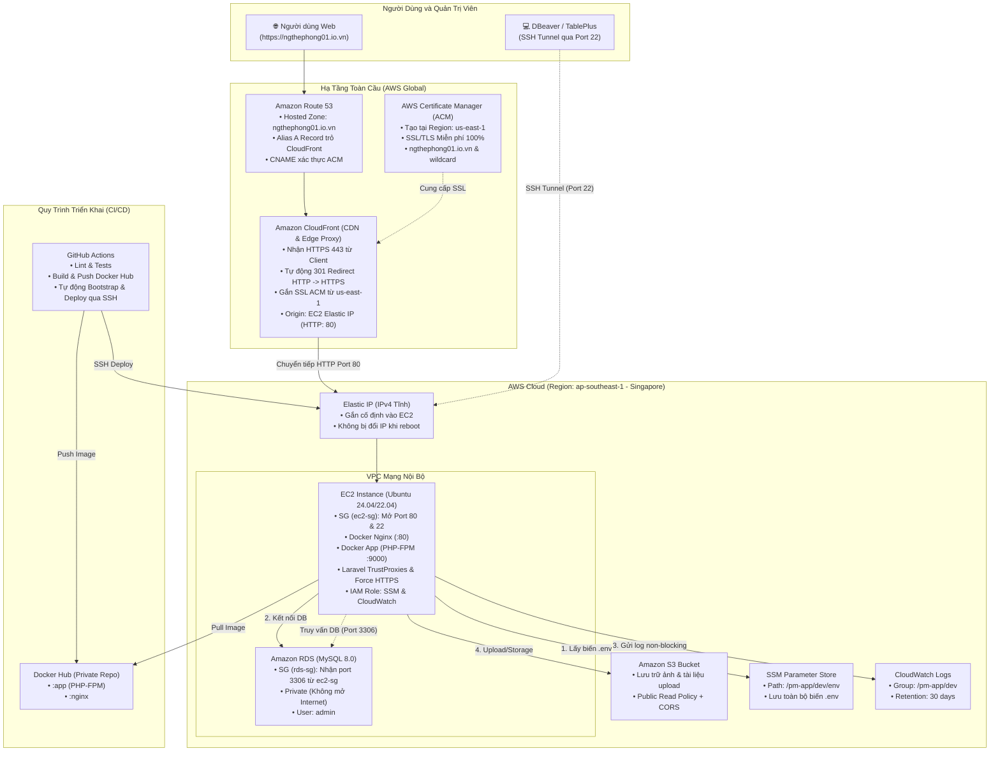

# Cẩm nang Thiết lập & Vận hành Hạ tầng AWS (Project Management)

Tài liệu này tổng hợp toàn bộ kiến thức, vai trò, quy trình từng bước thiết lập và các bài học kinh nghiệm về các dịch vụ AWS đã được chuẩn hóa trong dự án **Project Management** (`ngthephong01.io.vn`), tối ưu chi phí (loại bỏ ALB tốn phí, triển khai CloudFront CDN + ACM miễn phí và Elastic IP cố định).

---

## 1. Sơ đồ Kiến trúc Tổng thể (Architecture Diagram)



---

## 2. So sánh Kiến trúc Mới (CloudFront) vs Cũ (ALB)

| Tiêu chí | Kiến trúc Cũ (ALB) | Kiến trúc Mới (CloudFront + EIP) | Lợi ích Đạt Được |
| :--- | :--- | :--- | :--- |
| **Chi phí cố định** | ~$16.20 - $20 / tháng (ALB + LCU) | **$0 / tháng** (CloudFront Always Free 1TB Data Transfer) | Tiết kiệm trọn vẹn số tiền duy trì, bảo vệ credit $100 |
| **Chứng chỉ SSL (ACM)** | `ap-southeast-1` (Singapore) | **`us-east-1` (N. Virginia)** | Bắt buộc cho CloudFront; SSL được phân phối toàn cầu đến Edge VN/Singapore |
| **IP Máy chủ EC2** | IP Public động | **Elastic IP** (Cố định vĩnh viễn) | Khởi động lại server không bao giờ bị đổi IP |
| **Cổng mở trên EC2** | Port `8088` (chỉ nhận từ ALB-SG) | Port `80` (nhận từ CloudFront/Web) | Chuẩn hóa, trực quan, dễ kiểm tra |
| **CI/CD Deployment** | Cần server cài đặt sẵn môi trường | **Tự động Bootstrap EC2 mới tinh** | Chỉ cần cung cấp `EC2_HOST` và `EC2_SSH_KEY` |

---

## 3. Amazon Route 53 (DNS & Quản trị Tên miền)

### Vai trò:
- Quản lý phân giải tên miền cho `ngthephong01.io.vn`.
- Cung cấp tính năng **Alias Record** trỏ trực tiếp vào Amazon CloudFront Distribution hoàn toàn miễn phí truy vấn.

### Quy trình thiết lập:
1. **Khởi tạo Hosted Zone:**
   - Vào **Route 53** ➔ **Hosted zones** ➔ **Create hosted zone**.
   - **Domain name**: `ngthephong01.io.vn`
   - **Type**: `Public hosted zone`.
2. **Cập nhật Name Servers (NS) tại Nhà cung cấp Tên miền (Registrar):**
   - Route 53 sẽ cấp 4 địa chỉ NS (ví dụ: `ns-xxx.awsdns-xx.com`, `ns-xxx.awsdns-xx.org`...).
   - Vào trang quản lý tên miền (VNG Cloud, iNet, Namecheap...): **Thay đổi toàn bộ Name Server trỏ về 4 NS của AWS**.
   > [!CAUTION]
   > Phải **xóa hoàn toàn các NS mặc định của nhà cung cấp cũ**. Nếu để lẫn lộn NS cũ và mới, các DNS resolver trên thế giới sẽ truy vấn luân phiên, dẫn tới 50% yêu cầu bị lỗi `NXDOMAIN` (`Could not resolve host`).
3. **Tạo bản ghi Alias A trỏ vào CloudFront:**
   - Chọn Hosted Zone `ngthephong01.io.vn` ➔ **Create record**.
   - **Record name**: để trống (cho root domain `ngthephong01.io.vn`).
   - **Record type**: `A`.
   - Bật toggle **Alias**.
   - **Route traffic to**: Chọn *Alias to CloudFront distribution*.
   - **Choose distribution**: Chọn Distribution vừa tạo (`dxxxxxxxxxxxx.cloudfront.net`).
   - Routing policy: `Simple routing`.

---

## 4. AWS Certificate Manager - ACM (Chứng chỉ SSL/TLS Miễn phí)

### Vai trò:
- Cung cấp chứng chỉ SSL/TLS chuẩn HTTPS tin cậy toàn cầu.
- Tự động gia hạn (Auto-renewal) vĩnh viễn, không lo hết hạn SSL.

### Quy trình thiết lập:
> [!IMPORTANT]
> **Quy định của AWS:** Chứng chỉ gắn vào CloudFront **bắt buộc phải được tạo tại Region `US East (N. Virginia) us-east-1`**. Bản sao chứng chỉ sẽ tự động đồng bộ về mọi trạm Edge ở Việt Nam và Châu Á, không gây bất kỳ độ trễ nào.

1. **Yêu cầu chứng chỉ (Request Certificate):**
   - Đổi Region sang **`US East (N. Virginia) us-east-1`**.
   - Mở dịch vụ **Certificate Manager**.
   - Chọn **Request a certificate** ➔ **Request a public certificate**.
   - **Domain names**:
     - Tên miền chính: `ngthephong01.io.vn`
     - Thêm tên miền phụ (Wildcard): `*.ngthephong01.io.vn`.
   - **Validation method**: Chọn **DNS validation**.
   - Key algorithm: `RSA 2048` ➔ Nhấn **Request**.
2. **Xác thực chứng chỉ qua Route 53 (DNS Validation):**
   - Bấm vào Certificate vừa tạo.
   - Tại mục *Domains*, nhấn nút **Create records in Route 53** ➔ Nhấn **Create records**.
   - Đợi 1 - 3 phút, trạng thái chứng chỉ sẽ chuyển sang **Issued** màu xanh lục.

---

## 5. Amazon CloudFront (CDN, HTTPS Edge Proxy & Caching)

### Vai trò:
- Đóng vai trò Reverse Proxy mặt tiền của toàn bộ hệ thống (thay thế ALB).
- Tiếp nhận kết nối HTTPS (port 443) từ người dùng, giải mã SSL tại trạm Edge, chuyển tiếp traffic qua HTTP (port 80) vào máy chủ EC2.
- Miễn phí 1TB data transfer và 10 triệu request mỗi tháng.

### Quy trình thiết lập:
1. Vào **CloudFront** ➔ **Create a CloudFront distribution**.
2. **Origin:**
   - **Origin type**: Chọn **`Other`** *(không chọn VPC Origin để tránh phát sinh chi phí)*.
   - **Origin domain**: Dán địa chỉ **Public IPv4 DNS** của EC2 (lấy tại Details của EC2 instance: `ec2-xx-xx-xx-xx.ap-southeast-1.compute.amazonaws.com`).
   - **Protocol**: Chọn **`HTTP only`** (Port `80`).
   - **Enable Origin Shield**: Chọn **`No`**.
3. **Default cache behavior (Cấu hình chuẩn cho Laravel):**
   - **Viewer protocol policy**: Chọn **`Redirect HTTP to HTTPS`**.
   - **Allowed HTTP methods**: Chọn **`GET, HEAD, OPTIONS, PUT, POST, PATCH, DELETE`** *(hỗ trợ đầy đủ RESTful API, Form submission, Login)*.
   - **Cache key and origin requests**:
     - Chọn **Cache policy and origin request policy**.
     - **Cache policy**: Chọn **`CachingDisabled`** *(để không bị cache session/cookie giữa các người dùng)*.
     - **Origin request policy**: Chọn **`AllViewerExceptHostHeader`** *(chuyển tiếp đầy đủ Cookies, Headers, Query Strings lên EC2)*.
4. **Web Application Firewall (WAF):**
   - Chọn **Do not enable security protections** *(tiết kiệm chi phí)*.
5. **Settings:**
   - **Alternate domain name (CNAME)**: Điền `ngthephong01.io.vn`.
   - **Custom SSL certificate**: Chọn chứng chỉ ACM vừa cấp ở mục 4.
6. Nhấn **Create distribution**.

---

## 6. Amazon EC2 & Elastic IP (Máy chủ Ứng dụng & IP Tĩnh)

### Vai trò:
- Chạy Docker container (`nginx` :80 và `app` PHP-FPM :9000).
- Elastic IP đảm bảo địa chỉ IPv4 không bao giờ thay đổi khi reboot.

### Quy trình thiết lập:
1. **Khởi tạo Security Group (`ec2-sg`):**
   - Inbound Rules:
     - `SSH (Port 22)`: Source `0.0.0.0/0` (dành cho quản trị & CI/CD).
     - `HTTP (Port 80)`: Source `0.0.0.0/0` (dành cho CloudFront & Web traffic).
   - Outbound Rules: `All traffic (0.0.0.0/0)`.
2. **Khởi tạo EC2 Instance:**
   - **Name**: `pm-server`.
   - **Region**: `ap-southeast-1` (Singapore).
   - **AMI**: Ubuntu Server 24.04 LTS hoặc 22.04 LTS (64-bit x86).
   - **Instance Type**: `t3.micro` hoặc `t2.micro`.
   - **Key pair**: Tạo và tải file `.pem` (`pm-ec2-key.pem`).
   - **Security Group**: Gắn `ec2-sg`.
   - **Storage**: `20 GiB gp3` *(đủ sức chứa Docker images thoải mái)*.
3. **Cấp phát & Gắn Elastic IP (Bắt buộc):**
   - EC2 Console ➔ **Elastic IPs** ➔ **Allocate Elastic IP address**.
   - Chọn IP vừa cấp ➔ **Actions** ➔ **Associate Elastic IP address** ➔ Gắn vào instance `pm-server`.
4. **Gắn IAM Instance Profile cho EC2:**
   - Tạo IAM Role `EC2-ProjectManagement-Role` có gắn policy:
     - `AmazonSSMManagedInstanceCore`
     - Inline policy cho CloudWatch Logs (`logs:CreateLogGroup`, `logs:CreateLogStream`, `logs:PutLogEvents`, `logs:DescribeLogStreams`).
   - EC2 Console ➔ Chọn instance ➔ **Actions** ➔ **Security** ➔ **Modify IAM role** ➔ Chọn role vừa tạo.

---

## 7. Amazon S3 (Lưu trữ Tệp tin & Ảnh Upload)

### Vai trò:
- Lưu trữ toàn bộ ảnh đại diện, ảnh dự án, file đính kèm độc lập với máy chủ EC2.

### Quy trình thiết lập:
1. **Tạo Bucket:**
   - Tên: Duy nhất toàn cầu (ví dụ: `pm-storage-phong-01`).
   - Region: `ap-southeast-1` (Singapore).
   - **Bỏ tích** ô `Block all public access` (vì ảnh cần hiển thị công khai qua web).
2. **Bucket Policy (Cho phép xem ảnh công khai):**
   ```json
   {
     "Version": "2012-10-17",
     "Statement": [
       {
         "Sid": "PublicReadGetObject",
         "Effect": "Allow",
         "Principal": "*",
         "Action": "s3:GetObject",
         "Resource": "arn:aws:s3:::<ten-bucket-cua-ban>/*"
       }
     ]
   }
   ```
3. **Cấu hình CORS:**
   ```json
   [
     {
       "AllowedHeaders": ["*"],
       "AllowedMethods": ["GET", "HEAD"],
       "AllowedOrigins": ["*"],
       "ExposeHeaders": []
     }
   ]
   ```
4. **Tạo Access Key:**
   - Vào IAM ➔ Users ➔ `admin-phong` ➔ Security credentials ➔ Create access key.
   - Lưu lại `AWS_ACCESS_KEY_ID` và `AWS_SECRET_ACCESS_KEY`.

---

## 8. Amazon RDS (MySQL 8.0 Database)

### Vai trò:
- Quản lý cơ sở dữ liệu MySQL tách biệt, an toàn trong mạng nội bộ VPC.

### Quy trình thiết lập:
1. **Khởi tạo RDS Database:**
   - Engine: MySQL 8.0.
   - Template: Free tier (`db.t3.micro` hoặc `db.t4g.micro`).
   - **Master username**: **`admin`** *(Lưu ý: Không dùng `root`)*.
   - **Master password**: Mật khẩu mạnh.
   - **Initial database name**: **`project_management`** *(Bắt buộc điền ở mục Additional configuration)*.
   - **Public access**: **No** *(Chỉ kết nối nội bộ)*.
   - Storage autoscaling: Tắt (Disable).
2. **Cấu hình Security Group cho RDS (`rds-sg`):**
   - Vào EC2 ➔ Security Groups ➔ `rds-sg` ➔ Inbound rules:
     - Type: `MySQL/Aurora` (Port `3306`).
     - Source: Chọn **`ec2-sg`** (Security Group ID của EC2).
3. **Kết nối quản trị DB từ máy tính cá nhân (DBeaver / TablePlus):**
   - Dùng **SSH Tunnel**:
     - SSH Host: Elastic IP của EC2 (Port 22, User: `ubuntu`, Key: `.pem`).
     - DB Host: Endpoint của RDS (Port 3306, User: `admin`, Database: `project_management`).

---

## 9. AWS SSM Parameter Store & CloudWatch Logs

### 1. SSM Parameter Store (`/pm-app/dev/env`):
- Vào AWS Systems Manager ➔ Parameter Store ➔ Create parameter:
  - **Name**: `/pm-app/dev/env`
  - **Type**: `SecureString`
  - **Value**:
    ```env
    APP_NAME=ProjectManagement
    APP_ENV=production
    APP_KEY=base64:YOUR_APP_KEY_HERE
    APP_DEBUG=false
    APP_URL=https://ngthephong01.io.vn

    LOG_CHANNEL=stderr
    LOG_LEVEL=info

    DB_CONNECTION=mysql
    DB_HOST=<endpoint_rds_cua_ban>
    DB_PORT=3306
    DB_DATABASE=project_management
    DB_USERNAME=admin
    DB_PASSWORD="<mat_khau_rds>"

    BROADCAST_DRIVER=log
    CACHE_DRIVER=file
    QUEUE_CONNECTION=sync
    SESSION_DRIVER=file
    SESSION_LIFETIME=120

    FILESYSTEM_DISK=s3
    AWS_ACCESS_KEY_ID=<Access_Key_S3>
    AWS_SECRET_ACCESS_KEY=<Secret_Access_Key_S3>
    AWS_DEFAULT_REGION=ap-southeast-1
    AWS_BUCKET=<ten_bucket_s3>
    AWS_USE_PATH_STYLE_ENDPOINT=false

    VITE_APP_NAME="${APP_NAME}"
    ```

### 2. CloudWatch Log Group:
- CloudWatch ➔ Log groups ➔ Create log group:
  - **Name**: `/pm-app/dev`
  - **Retention**: `30 days` (tự động xóa log cũ để tiết kiệm chi phí).

---

## 10. Cấu hình Docker & Laravel (Port 80 & HTTPS Enforcement)

### 1. `docker-compose.aws.yml`:
Nginx lắng nghe trực tiếp trên Port 80 để nhận traffic từ CloudFront:
```yaml
services:
  app:
    image: ${DOCKER_REPO:-project-management}:app
    restart: unless-stopped
    volumes:
      - ./.env:/var/www/.env:ro
      - storage-uploads:/var/www/storage/app/public
    logging:
      driver: "awslogs"
      options:
        awslogs-region: "ap-southeast-1"
        awslogs-group: "${LOG_GROUP:-/pm-app/dev}"
        awslogs-stream: "app"
        mode: "non-blocking"
        max-buffer-size: "4m"

  nginx:
    image: ${DOCKER_REPO:-project-management}:nginx
    restart: unless-stopped
    ports:
      - "${APP_PORT:-80}:80"
    depends_on:
      - app
    volumes:
      - storage-uploads:/var/www/public/storage:ro
    logging:
      driver: "awslogs"
      options:
        awslogs-region: "ap-southeast-1"
        awslogs-group: "${LOG_GROUP:-/pm-app/dev}"
        awslogs-stream: "nginx"
        mode: "non-blocking"
        max-buffer-size: "4m"

volumes:
  storage-uploads:
```

### 2. Ép HTTPS trong Laravel (`app/Providers/AppServiceProvider.php`):
```php
public function boot(): void
{
    if ($this->app->environment('production')) {
        URL::forceScheme('https');
    }
}
```

---

## 11. Tự động hóa CI/CD Pipeline (GitHub Actions Auto-Bootstrap)

Pipeline trong `.github/workflows/ci.yml` được trang bị tính năng **Tự động Bootstrap**:
- Nếu máy chủ EC2 mới tinh chưa có Docker, pipeline sẽ tự động cài Docker CE + Docker Compose plugin.
- Nếu chưa có AWS CLI, tự động cài AWS CLI.
- Nếu chưa clone code, tự động clone repo về `~/project-management`.
- Tự động kéo `.env` từ SSM Parameter Store.
- Đăng nhập Docker Hub, pull image mới nhất và khởi chạy container.

### Cấu hình GitHub Secrets tối giản:
Chỉ cần cung cấp 2 secret này (cùng thông tin Docker Hub):
1. **`EC2_HOST`**: Điền địa chỉ **Elastic IP** của EC2.
2. **`EC2_SSH_KEY`**: Dán toàn bộ nội dung file `.pem`.
3. `EC2_USER`: Để trống hoặc điền `ubuntu` (pipeline mặc định fallback về `ubuntu`).
4. `DOCKERHUB_USERNAME` & `DOCKERHUB_TOKEN`: Thông tin đăng nhập Docker Hub.

---

## 12. Cảnh báo Chi phí AWS & Hướng dẫn Dọn dẹp (Cost Teardown)

1. **Bẫy Elastic IP chưa gắn (Unattached EIP):**
   - Nếu bạn `Stop` hoặc `Terminate` EC2, bạn **bắt buộc phải vào Elastic IPs và nhấn Release**. Nếu giữ Elastic IP mà không gắn vào instance đang chạy, AWS sẽ phạt $0.005/giờ.
2. **Bẫy RDS tự bật lại:**
   - Khi bạn `Stop` RDS, sau 7 ngày AWS sẽ tự động bật lại và tính phí. Nếu không còn dùng, hãy Delete RDS (có thể chọn tạo final snapshot).
3. **Ổ cứng EBS:**
   - Ổ cứng EBS tính tiền lưu trữ $0.10/GB/tháng. Khi terminate instance, hãy xóa volume đi kèm.
4. **CloudFront & ACM:**
   - ACM Certificate miễn phí 100%. CloudFront miễn phí 1TB data transfer ra ngoài mỗi tháng.

---

## 13. Tổng kết Kỹ thuật & Bài học Kinh nghiệm (Gotchas & Best Practices)

| Tình huống / Lỗi thực tế | Nguyên nhân gốc rễ | Giải pháp chuẩn mực đã áp dụng |
| :--- | :--- | :--- |
| **CloudFront không nhận chứng chỉ ACM** | Chứng chỉ được tạo ở Singapore (`ap-southeast-1`). CloudFront chỉ chấp nhận ACM ở `us-east-1`. | Tạo chứng chỉ ACM tại Region `us-east-1` (N. Virginia). |
| **Origin domain trong CloudFront báo lỗi khi điền IP** | AWS CloudFront chặn không cho điền dãy số IP thuần vào ô Origin Domain. | Dán địa chỉ **Public IPv4 DNS** của EC2 (tương ứng với Elastic IP) thay vì điền số IP. |
| **Không sửa được CIDR rule thành `ec2-sg` trong `rds-sg`** | Giao diện AWS không cho phép sửa trực tiếp một rule kiểu IP thành Security Group ID. | Bấm Delete xóa dòng rule cũ, sau đó bấm Add rule mới và chọn Source là `ec2-sg`. |
| **Lỗi CSRF Token / Session bị đảo lộn khi dùng CloudFront** | CloudFront mặc định cache hoặc không forward Cookie và HTTP headers cho ứng dụng động. | Đặt Cache policy là `CachingDisabled` và Origin request policy là `AllViewerExceptHostHeader`. |
| **Mất kết nối server sau khi reboot** | EC2 dùng IP Public động, sau mỗi lần reboot AWS sẽ cấp một IP mới khác hoàn toàn. | Cấp phát và gắn **Elastic IP** cố định vào máy chủ EC2. |
| **Lỗi `Access denied for user 'root'` trên RDS** | AWS RDS MySQL mặc định tạo user `admin`, không hỗ trợ user `root`. | Sử dụng `DB_USERNAME=admin` trong `.env`. |
| **Treo máy chủ EC2 khi build Docker** | EC2 `t2/t3.micro` chỉ có 1GB RAM, build code/composer gây tràn RAM OOM. | Sử dụng mô hình **Pre-built Container Registry** trên Docker Hub, EC2 chỉ thực hiện `docker pull`. |
