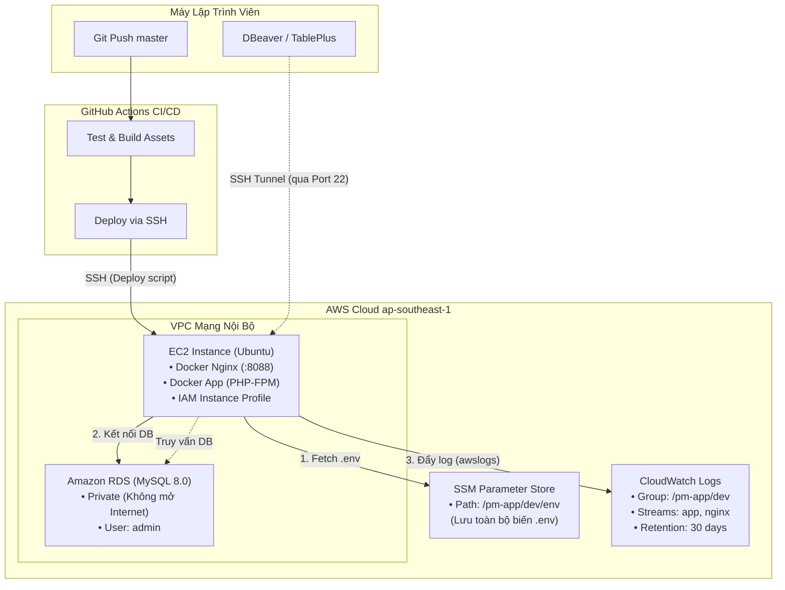

# Cẩm nang Thiết lập & Vận hành Hạ tầng AWS (Project Management)

Tài liệu này tổng hợp toàn bộ kiến thức, vai trò, quy trình từng bước thiết lập và các bài học kinh nghiệm về các dịch vụ AWS đã được triển khai trong dự án **Project Management**.

---

## 1. Sơ đồ Kiến trúc Tổng thể (Architecture Diagram)



---

## 2. Amazon EC2 (Elastic Compute Cloud - Máy chủ ứng dụng)

### Vai trò:
- Máy chủ Linux Ubuntu đóng vai trò host chạy các Docker container (`app` PHP-FPM, `nginx`).
- Đóng vai trò là **Bastion Host / SSH Bridge** để kết nối an toàn từ máy dev vào RDS private.

### Quy trình thiết lập:
1. **Khởi tạo Instance:**
   - **AMI**: Ubuntu Server 22.04 LTS hoặc 24.04 LTS.
   - **Instance Type**: `t2.micro` hoặc `t3.micro` (Free Tier).
   - **Key Pair**: Tạo key pair `.pem` và lưu trữ an toàn (dùng cấu hình GitHub Secret `EC2_SSH_KEY`).
2. **Cấu hình Security Group (Inbound Rules):**
   - Port `22` (SSH): Cho phép IP của developer hoặc GitHub runner.
   - Port `8088` (HTTP): Cho phép `0.0.0.0/0` để người dùng truy cập web.
3. **Cài đặt môi trường trên EC2:**
   ```bash
   sudo apt update && sudo apt install -y docker.io docker-compose-v2 awscli
   sudo usermod -aG docker $USER
   newgrp docker
   ```
4. **Gắn IAM Instance Profile:**
   - EC2 Console ➔ Chọn Instance ➔ **Actions** ➔ **Security** ➔ **Modify IAM role** ➔ Gắn Role được cấu hình ở mục IAM.

---

## 3. Amazon RDS (Relational Database Service - MySQL 8.0)

### Vai trò:
- Tách biệt cơ sở dữ liệu khỏi EC2 để đảm bảo độ bền dữ liệu, dễ dàng backup tự động và nâng cấp tài nguyên độc lập.

### Quy trình thiết lập:
1. **Khởi tạo Database Instance:**
   - **Engine**: MySQL (phiên bản 8.0).
   - **Template**: Free tier (`db.t3.micro` hoặc `db.t4g.micro`).
   - **Master username**: `admin` *(Lưu ý: Không dùng `root` vì RDS MySQL mặc định tạo user `admin`)*.
   - **Master password**: Tạo mật khẩu mạnh và lưu vào SSM Parameter Store.
   - **Initial database name**: `project_management`.
2. **Mạng & Bảo mật:**
   - **VPC**: Chọn cùng VPC với EC2.
   - **Publicly Accessible**: Chọn **No** (Chỉ cho phép truy cập nội bộ trong VPC).
3. **Cấu hình Security Group cho RDS (Inbound Rules):**
   - **Type**: MySQL/Aurora (Port `3306`).
   - **Source**: Chọn **Security Group ID của EC2** *(chỉ cho phép máy chủ EC2 truy cập vào cổng 3306)*.

### Cách kết nối & quan sát dữ liệu RDS từ máy tính cá nhân:
Không cần mở public RDS ra ngoài Internet. Sử dụng **DBeaver** hoặc **TablePlus** qua đường hầm **SSH Tunnel**:
- **Cấu hình SSH:**
  - SSH Host: IP Public của EC2.
  - SSH User: `ubuntu`.
  - SSH Key: Trỏ đến file `.pem`.
- **Cấu hình Database:**
  - Host: Endpoint của RDS (`xxxx.ap-southeast-1.rds.amazonaws.com`).
  - Port: `3306`.
  - User: `admin`.
  - Password: Mật khẩu RDS.
  - Database: `project_management`.

---

## 4. AWS Systems Manager (SSM) Parameter Store (Quản trị cấu hình)

### Vai trò:
- Lưu trữ tập trung và mã hóa toàn bộ biến môi trường (`.env`), tránh việc phải commit thông tin nhạy cảm lên Git.

### Quy trình thiết lập:
1. Vào **AWS Systems Manager** ➔ **Parameter Store** ➔ **Create parameter**.
2. Cấu hình thông số:
   - **Name**: `/pm-app/dev/env`
   - **Tier**: Standard
   - **Type**: `SecureString` (mã hóa tự động bằng AWS KMS)
   - **Value**: Dán toàn bộ nội dung file `.env` của server:
     ```env
     APP_NAME=ProjectManagement
     APP_ENV=production
     APP_KEY=base64:...
     APP_DEBUG=false
     APP_URL=http://<IP_EC2>:8088

     DB_CONNECTION=mysql
     DB_HOST=<endpoint_rds_cua_ban>
     DB_PORT=3306
     DB_DATABASE=project_management
     DB_USERNAME=admin
     DB_PASSWORD="<mat_khau_rds>"

     LOG_CHANNEL=stderr
     LOG_LEVEL=info
     ```
3. Lệnh pull `.env` trong CI/CD:
   ```bash
   aws ssm get-parameter \
     --region ap-southeast-1 \
     --name "/pm-app/dev/env" \
     --with-decryption \
     --query "Parameter.Value" \
     --output text > .env
   ```

---

## 5. Amazon CloudWatch Logs (Logging tập trung & Phân tích)

### Vai trò:
- Gom toàn bộ log từ container Docker (`nginx` HTTP traffic và `app` PHP-FPM / Laravel) lên AWS CloudWatch Logs.
- Giúp tra cứu, lọc và phân tích log trực quan mà không cần SSH vào máy chủ để gõ `docker logs`.

### Quy trình thiết lập:
1. **Khởi tạo Log Group kèm Retention Policy (30 ngày):**
   ```bash
   # Tạo log group
   aws logs create-log-group --log-group-name /pm-app/dev --region ap-southeast-1

   # Cấu hình tự động xóa log sau 30 ngày để tiết kiệm chi phí
   aws logs put-retention-policy --log-group-name /pm-app/dev --retention-in-days 30 --region ap-southeast-1
   ```
2. **Cấu hình Docker `awslogs` Logging Driver với chế độ Non-blocking:**
   Tạo file `docker-compose.aws.yml`:
   ```yaml
   services:
     app:
       logging:
         driver: "awslogs"
         options:
           awslogs-region: "ap-southeast-1"
           awslogs-group: "${LOG_GROUP:-/pm-app/dev}"
           awslogs-stream: "app"
           mode: "non-blocking"
           max-buffer-size: "4m"
     nginx:
       logging:
         driver: "awslogs"
         options:
           awslogs-region: "ap-southeast-1"
           awslogs-group: "${LOG_GROUP:-/pm-app/dev}"
           awslogs-stream: "nginx"
           mode: "non-blocking"
           max-buffer-size: "4m"
   ```
3. **Cấu hình PHP-FPM Pool:**
   Tạo file `docker/php/logging.conf` và nạp vào `/usr/local/etc/php-fpm.d/zz-logging.conf`:
   ```ini
   [www]
   catch_workers_output = yes
   decorate_workers_output = no
   ```
   *(Đảm bảo PHP-FPM worker không nuốt `php://stderr` của Laravel và không gắn tiền tố cảnh báo làm hỏng log JSON)*.

---

## 6. AWS IAM (Identity & Access Management - Phân quyền tối thiểu)

### Vai trò:
- Cấp quyền cho EC2 truy cập an toàn vào SSM Parameter Store và CloudWatch Logs mà không cần lưu Access Key / Secret Key trên server.

### Quy trình thiết lập:
1. Vào **IAM** ➔ **Roles** ➔ **Create role**:
   - Trusted entity: **AWS service**
   - Use case: **EC2**
2. **Phân quyền (Permissions):**
   - **SSM:** Gắn AWS Managed Policy `AmazonSSMManagedInstanceCore` (hoặc cấp action `ssm:GetParameter`).
   - **CloudWatch Logs (Least-Privilege Policy):** Tạo Inline Policy:
     ```json
     {
       "Version": "2012-10-17",
       "Statement": [
         {
           "Effect": "Allow",
           "Action": [
             "logs:CreateLogStream",
             "logs:PutLogEvents",
             "logs:DescribeLogStreams"
           ],
           "Resource": "arn:aws:logs:ap-southeast-1:*:log-group:/pm-app/dev:*"
         }
       ]
     }
     ```
3. Đặt tên role (ví dụ: `EC2-ProjectManagement-Role`) và gắn vào EC2 Instance.

---

## 7. Tổng kết Kỹ thuật & Bài học Kinh nghiệm (Gotchas & Best Practices)

| Vấn đề | Nguyên nhân | Giải pháp tối ưu đã triển khai |
| :--- | :--- | :--- |
| **`Permission denied` khi `git reset --hard`** | Container PHP chown thư mục `storage` và `bootstrap/cache` thành `www-data` (UID 82), khiến user EC2 (`ubuntu` UID 1000) không xóa/ghi đè được file `.gitignore`. | Thêm `sudo chown -R $(id -u):$(id -g) .` trước bước pull git trong CI/CD, đồng thời cấp quyền `777` cho storage trong entrypoint. |
| **`Access denied for user 'root'` khi kết nối RDS** | AWS RDS MySQL không dùng user `root` mà mặc định dùng `admin`. | Đổi `DB_USERNAME=admin` trong AWS SSM Parameter Store. |
| **Tại sao dùng `git reset --hard` thay vì `git pull` trong CI/CD?** | `git pull` dễ bị chặn do uncommitted changes, conflict hoặc force push. | `git reset --hard` đảm bảo server luôn khớp 100% với commit trên GitHub (tính Idempotent). |
| **App bị treo khi CloudWatch chậm/lỗi mạng** | Docker `awslogs` driver mặc định ở chế độ blocking. | Thiết lập `mode: non-blocking` kèm `max-buffer-size: 4m`. |
| **Không thấy log Laravel trên CloudWatch** | PHP-FPM mặc định bỏ qua worker output, Laravel mặc định ghi vào file cục bộ. | Đặt `LOG_CHANNEL=stderr` trong `.env` và bật `catch_workers_output = yes` trong PHP-FPM pool. |
| **Chi phí CloudWatch bị tăng theo thời gian** | Log group mặc định giữ log vĩnh viễn (Never expire). | Luôn gắn retention policy (30 ngày) cho log group. |
